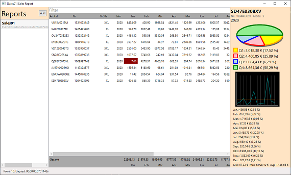

# SlowPerfApp

This repo contains a WPF application with **poor performance**. It's a **playground for** a workshop regarding **performance optimization** techniques.

## About the application

The application reads csv files with specified columns and displays the data in tabular form. It has a recent list and a graphical summary for a single data row.

The main layout has three columns and a status bar. In the left pane you find the recent list. The middle pane contains the data table. The right pane has some charts.

The first line in the csv file must contain the headers.

For the current selected csv file it shows the data in tabular form. The data table can be filtered. Columns can be sorted. In the footer, the total of the each columns is displayed.
Hovering over a row displays a graphical summary on the right of the data table. The graphical summary contains a pie chart showing quaterly totals and a line chart showing the relational monthly sales and the average. At the bottom it shows the monthly sales together with its percentage of the year total, the minimum/maximum/average value.

## Challenge

Find the performance bottlenecks and fix them! Also, there is some progress(bar) implemented. But did you see that at runtime?
Play around with the code and make it faster and better.

## License

SlowPerfApp is licensed under the [MIT](LICENSE.MD) license.